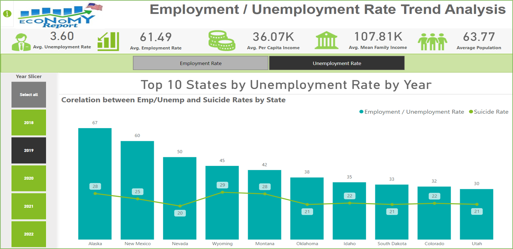

# Power-BI-Impact-of-Unemployment-on-Mental-Health
This is my Power BI Project for the University of South Florida Master Program in Aritficial Intelligence and Business Analytics.

## Project Overview

This Power BI project aims to analyze the relationship between unemployment rates and mental health outcomes, focusing on depression and suicide rates. The project utilizes various datasets to provide insights into how economic indicators such as GDP and Mean Median Family Income correlate with Mental Health statistics across different demographic groups.

## Research Questions

Q1. What is the relationship between the temporal variations in Unemployment Rates and the prevalence of Depressive Disorders among adults over the observed period? 
Q2. How do Unemployment Rates correlate with Suicide Rates across the top 10 states with the highest Unemployment, and what are the trends across the top 10 states with the highest in Mean and Median family income with respect to Population over the years?
Q3. How do economic factors, healthcare access, and demographic characteristics influence mental health outcomes, specifically the 	incidence of suicide, across different states by population factor? 

## Data Sources

- **U.S. Bureau of Labor Statistics:** [Unemployment in USA](https://www.bls.gov/web/laus.supp.toc.htm )
- **Data.Gov:** [U.S. Chronic Disease Indicators ](https://catalog.data.gov/dataset/u-s-chronic-disease-indicators-cdi)
- **Centers for Disease Control and Prevention CDC:** [Depression among adults](https://wonder.cdc.gov/controller/datarequest/D77)
- **USA Facts:** [Gross domestic product ](https://usafacts.org/metrics/gross-domestic-product-gdp-by-state/)
- **Centers for Disease Control and Prevention CDC** [Suicide Mortality by State](https://www.cdc.gov/nchs/pressroom/sosmap/suicide-mortality/suicide.htm)
- **United States Census Bureau** [Selected Economic Characteristics](https://data.census.gov/table/ACSDP1Y2022.DP03?q=Economic%20charactertics&g=010XX00US$0400000)

## Project Files

- `Executive Scorecard - Impact of Unemployment on Mental Health.pbix`: Power BI report file.
- `Images/`: Directory containing images used in the report.
- `User Guide- Executive Scorecard- Impact of Unemployment on Mental Health/`: Directory containing project User Guide.

## Project Structure

- **Tab 0: Overview**: Introduction and background of the project.
- **Tab 1: Depression & Employment Analysis**: Analysis of depression rates in relation to unemployment rates.
- **Tab 2: Family Income by Year Analysis**: Insights on mean and median family incomes over the years.
- **Tab 3: Unemployment by Year Insights**: Correlation between unemployment and suicide rates.
- **Tab 4: Economic & Health Coverage Analysis**: Analysis of economic factors and healthcare access.
- **Tab 5: Mental Health Cases by State Analysis**: Distribution of mental health cases across states.

## Visualizations for Question 1

### Depression & Employment Analysis
- **Stacked Bar Chart**: Annual percentage of adults diagnosed with depression (2018-2022).
- **Clustered Column Chart**: Average depression rates across demographics.
- **Clustered Column Chart**: Comparison of unemployment and depression rates (2018-2022).
- **Line and Clustered Column Chart**: Yearly trends of average unemployment and depression rates.
### Mental Health Cases by State Analysis
- **Map Visual**: Distribution of mental health cases by state.

### Q1. What is the relationship between the temporal variations in Unemployment Rates and the prevalence of Depressive Disorders among adults over the observed period?

#### Explanation
Depression rates spiked in 2020 during the COVID-19, reflecting the immense economic stress and job losses experienced at that time. Before the pandemic, depression rates were declining, but the sudden increase in 2020 highlights the dramatic effect of external crises on mental health. In the same year, depression rates rose across all demographic groups, with notable increases among different racial and ethnic categories. This widespread rise indicates that the pandemic's economic fallout affected everyone, though some communities were more severely impacted than others enforcing mental health.

The sharp rise in both unemployment and depression rates in 2020 shows a direct link between economic downturns and mental health issues. During stable economic periods, depression rates saw smaller changes, reinforcing the idea that stable employment is crucial for mental well-being. This recovery pattern suggests that job market improvements can positively influence mental health, emphasizing the importance of economic stability for overall well-being.

#### Justification
These visuals tell a compelling story of how the COVID-19 pandemic and the resulting economic downturn significantly affected mental health in the U.S. Depression rates soared alongside rising unemployment, showing the close relationship between economic conditions and mental health. As the economy recovered, mental health outcomes improved, showcasing the critical role of economic stability in supporting mental health.

## Visualizations for Question 2

### Family Income by Year Analysis
- **Line and Stacked Column Chart**: Mean and median family income trends.

### Unemployment by Year Insights
- **Line and Stacked Column Chart**: Unemployment rates and suicide rates correlation.

### Q2. How do unemployment rates correlate with suicide rates across the top 10 states with the highest unemployment, and what are the trends across the top 10 states with the highest in Mean and Median family income with respect to Population over the years? 

#### Explanation
Mean and Median Family Income Trends   
For Mean : Over the years the District of Columbia and Massachusetts from 2019 to 2021, these states showed a consistent rise in mean family incomes, indicating economic resilience and growth. Population rates in these states remained relatively stable, suggesting a balance between economic prosperity and population growth.
For Median : Similarly, states with the highest median family incomes, including the District of Columbia and Maryland, exhibited robust economic health. Despite the pandemic, these states managed to maintain or slightly increase their median family incomes. Population trends in these states also showed stability, reflecting the overall economic strength and attractiveness of these regions.
Unemployment Rates and Suicide Rates Correlation
2020, Nevada experienced a significant spike in Unemployment due to the COVID-19 pandemic, which coincided with a rise in suicide rates, reflecting the severe Mental Health impact of economic distress. The concurrent rise in suicide rates during periods of high unemployment underscores the direct correlation between economic hardship and mental health struggles.

#### Justification
As seen High Unemployment Rates are strongly linked to higher Suicide Rates. Data from the top 10 states with the highest Unemployment Rates show that economic distress leads to increased Mental Health challenges, evident in the rise of Suicide Rates during periods of high Unemployment. States with the highest mean and median family incomes demonstrate economic resilience and growth, maintaining or increasing their incomes even during the pandemic, indicating strong economic foundations. In conclusion, the analysis highlights the significant impact of economic conditions on Mental Health, with high Unemployment Rates correlating with increased Suicide Rates.

## Visualizations for Question 3

### Economic & Health Coverage Analysis
- **Line and Stacked Column Chart**: Income and GDP trends.
- **Pie Chart**: Distribution of suicide cases by demographic category.
- **Line Chart**: Population Below Poverty Line, Population with Health Insurance, and overall Population Rate.

 

### Q3. How do economic factors, healthcare access, and demographic characteristics influence mental health outcomes, specifically the incidence of suicide, across different states by population factor?
 
#### Explanation & Justification
The provided visuals collectively address this question by presenting data on economic factors, healthcare access, demographic characteristics, and population metrics in relation to mental health outcomes, particularly suicide rates.
These visuals show rising GDP and family incomes from 2018 to 2022, indicating economic growth and improved financial stability towards 2022, which can positively impact mental health.
Top 5 States with Health Insurance visual compares health insurance coverage, per capita income, and poverty levels across states. States with higher health insurance coverage often have better mental health outcomes due to improved access to healthcare services.
The pie chart highlights the distribution of suicide cases by race/ethnicity and gender, showing that demographic characteristics play a significant role in understanding suicide rates.
Top 10 States with Highest Population Rate visual compares poverty, Health Insurance coverage, and Population Rates. It shows how higher population states like New York and DC have varied poverty and insurance data, affecting mental health outcomes. 

#### Note : Population visual provides additional context for analyzing income, poverty, and health insurance coverage. It shows that higher population states like the DC and New York have more people below the poverty line and without health insurance. This perspective highlights how population size influences the perception of poverty and insurance coverage, emphasizing the importance of considering population metrics in socioeconomic analysis. The insights complement Visual 2, illustrating the complexity and multifaceted nature of economic well-being across different states.

## Contributing
Contributions are welcome. Please open an issue or submit a pull request for any enhancements or bug fixes.

## Acknowledgments
- Akanksha Kushwaha for project submission.
- Power BI Consulting.inc for guidance and resources.

